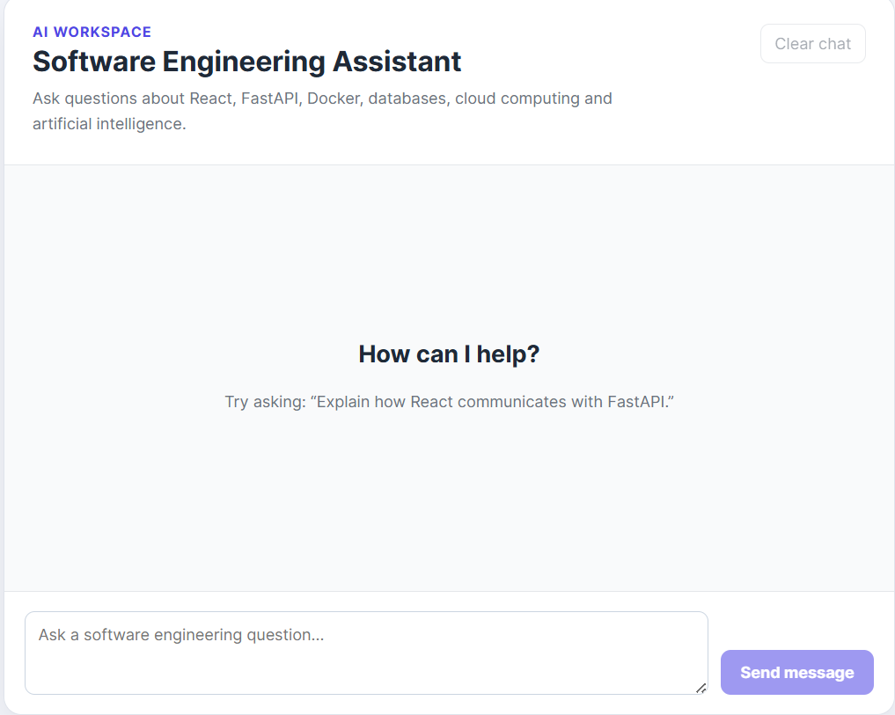
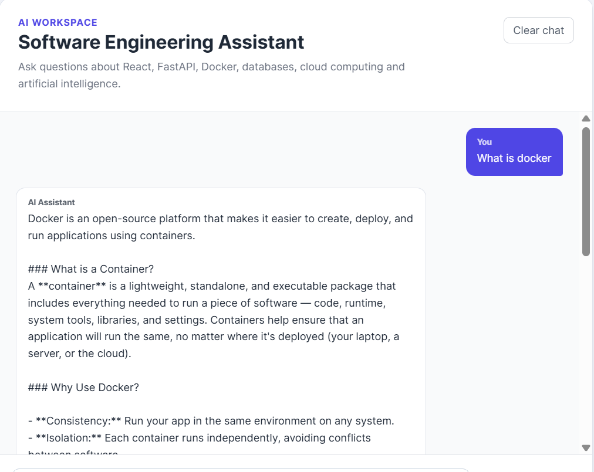
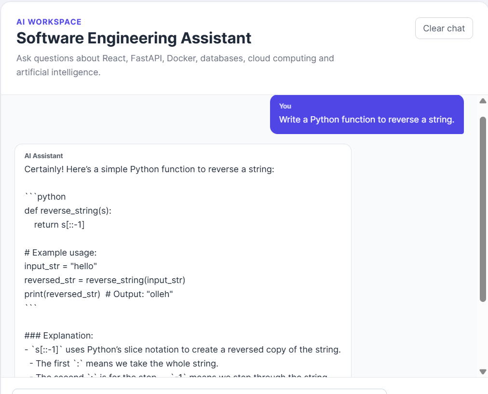

# AI Workspace

An AI-powered full-stack web application that combines a React frontend with a FastAPI backend to provide an intelligent software engineering assistant. Users can ask programming questions, receive AI-generated responses, and manage tasks through a clean and responsive interface.

---

## 🚀 Live Demo

**Frontend:** https://ai-workspace-blue-nine.vercel.app
**Backend API:** https://ai-workspace-production-2f73.up.railway.app

---

## ✨ Features

- 🤖 AI software engineering assistant powered by OpenAI
- ✅ Task management (Create, Read, Update and Delete tasks)
- ⚡ FastAPI REST API
- 🎨 Modern React + Vite frontend
- 🗄️ SQLAlchemy database integration
- 🐳 Docker containerisation
- ☁️ Railway backend deployment
- ▲ Vercel frontend deployment
- 🔒 Environment variables for secure API key management

---

## 🛠️ Tech Stack

### Frontend

- React
- Vite
- JavaScript
- CSS

### Backend

- FastAPI
- Python
- SQLAlchemy
- OpenAI API

### Deployment

- Docker
- Railway
- Vercel
- Git & GitHub

---

## 📷 Screenshots

### Home Page



The main dashboard of AI Workspace, featuring the AI assistant interface.

---

### AI Assistant



Example conversation with the AI software engineering assistant powered by OpenAI.

---

### Programming Assistance



Example conversation with the AI software engineering assistant powered by OpenAI.
---

## ⚙️ Running Locally

### Clone the repository

```bash
git clone https://github.com/SHassan29/AI-Workspace.git
cd AI-Workspace
```

### Frontend

```bash
npm install
npm run dev
```

### Backend

```bash
cd backend
python -m venv venv
pip install -r requirements.txt
uvicorn main:app --reload
```

---

## 📁 Project Structure

```
AI-Workspace/
│
├── backend/
│   ├── main.py
│   ├── models.py
│   ├── database.py
│   └── requirements.txt
│
├── src/
│
├── public/
│
└── README.md
```

---

## 👨‍💻 Author

**Subhaan Hassan**

GitHub: https://github.com/SHassan29